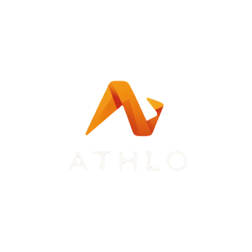

# Athlo - Front-End 

Athlo est une plateforme web destinée aux **coachs sportifs**, pour gérer leurs clients, leurs séances, leurs programmes, la facturation et la relation client.  

Ce dépôt contient uniquement le **Front-End** de l'application, développé avec **React** et **Tailwind CSS**.

---

## Contexte du projet

Le projet fait partie du programme **ArchiWeb 2026** et vise à créer une application web complète pour les coachs sportifs.  

**Objectifs Front-End :**
- Afficher l'interface utilisateur responsive (desktop et mobile)
- Communiquer avec le back via les API REST
- Visualiser les données des clients, séances, programmes et facturation
- Fournir une expérience utilisateur claire et moderne

---

## Fonctionnalités principales du Front

- Gestion des clients et prospects
- Vue calendrier des séances
- Consultation et suivi des programmes
- Messagerie interne
- Dashboards et indicateurs de performance
- Boutique en ligne (produits numériques et physiques)
- Notifications et alertes

---

## Stack technique

- **React 18** – bibliothèque front-end
- **Vite** – bundler et serveur de développement
- **Tailwind CSS** – framework CSS
- **Axios / Fetch** – appels API REST
- **Prop-types** – vérification des props React
- **React Router** – routage côté client

---

## Documentation

Toutes les étapes d’installation et de configuration sont détaillées dans le fichier :  
[installation.md](docs/installation.md)

---

## Maquette

https://stitch.withgoogle.com/projects/15655097857567584238

---

## Auteur

- **Groupe 6 ArchiWeb 2026**
